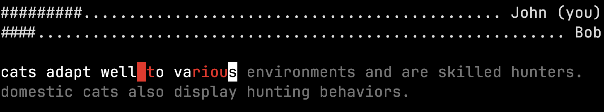

# FastPaws


- [About](#about)
  - [Purpose](#purpose)
- [How to play](#how-to-play)
  - [Game logic](#game-logic)
- [Usage](#usage)
  - [Server](#server)
  - [Client](#client)
- [Example](#example)
- [Development](#development)
  - [Building the Docker Image](#building-the-docker-image)
  - [Pushing the Docker Image](#pushing-the-docker-image)
- [References](#references)
- [Authors](#authors)


## About

FastPaws is a terminal based typing game that is played using a client-server architecture. It works with the UDP protocol. To learn more about the networking, refer to the [Protocol Documentation](docs/protocol.md).

### Purpose

The purpose of this project is to create a simple and efficient client-server for a typing race using the UDP protocol.



## How to play

```
   ____         __  ___                
  / __/__ ____ / /_/ _ \___ __    _____
 / _// _ `(_-</ __/ ___/ _ `/ |/|/ (_-<
/_/  \_,_/___/\__/_/   \_,_/|__,__/___/
                                       
```

You are given a paragraph and your goal is to type it without making any mistakes.
You win by being the first player to correctly type the paragraph.

You cannot win the game if you have typos in your paragraph. Make sure to correct all your mistakes.

Good luck!

### Game logic

The game logic is as follows:

- The server starts the game if there are at least **two** clients connected and ready.
- If a client connects during the game, the client will have to wait for the end of the current game to play.

## Usage

Make sure you have docker installed on your machine. You can refer to the [Development](#development) section on how to run the application without docker.

To run the aplication, you can use the following commands:

```bash
# Pull the image
docker pull ghcr.io/heigvd-s3-dai/fastpaws:latest

# Run the application
docker run --network host --rm -it ghcr.io/heigvd-s3-dai/fastpaws:latest -h
```

```bash
Usage: app.jar [-hV] [COMMAND]
A typing game client-server application
  -h, --help      Show this help message and exit.
  -V, --version   Print version information and exit.
Commands:
  client  Start a client to connect to the server
  server  Start a server to connect to the server
```

### Server

```bash
docker run --network host --rm -it ghcr.io/heigvd-s3-dai/fastpaws:latest server -h
```

```bash
Usage: app.jar server [-hV] [-H=<host>] [-M=<multicastAddress>] [-p=<port>]
                      [-pm=<multicastPort>]
Start the server to connect to the server
  -h, --help          Show this help message and exit.
  -H, --host=<host>   Server host (default: localhost).
  -M, --multicast-address=<multicastAddress>
                      Multicast address to use for the clients (default:
                        230.0.0.0).
  -p, --port=<port>   Port to use for the clients (default: 4445).
      -pm, --multicastPort=<multicastPort>
                      Port to use for the server (default: 4446).
  -V, --version       Print version information and exit.
```

### Client

```bash
docker run --network host --rm -it ghcr.io/heigvd-s3-dai/fastpaws:latest client -h
```
```bash
Usage: app.jar client [-hV] [-H=<serverHost>] -I=<networkInterface>
                      [-M=<serverMulticastAddress>] [-p=<serverPort>]
                      [-pm=<serverMulticastPort>]
Start a client to connect to the server
  -h, --help      Show this help message and exit.
  -H, --serverHost=<serverHost>
                  Server host (default: localhost).
  -I, --network-interface=<networkInterface>
                  Network interface to use
  -M, --multicast-address=<serverMulticastAddress>
                  Multicast address to use for the server (default: 230.0.0.0).
  -p, --serverPort=<serverPort>
                  Port to use for the server (default: 4445).
      -pm, --serverMulticastPort=<serverMulticastPort>
                  Port to use for the server multicast (default: 4446).
  -V, --version   Print version information and exit.
```

## Example

The following will demonstrate how to run the application locally.

1. Start the server:
   ```bash
   docker run --network host --rm -it ghcr.io/heigvd-s3-dai/fastpaws:latest server
   ```
2. Start the client:
   ```bash
   docker run --network host --rm -it ghcr.io/heigvd-s3-dai/fastpaws:latest client -I eth0
   ```
3. The client will prompt you to enter your username. Enter your username and press enter.
4. Repeat step 2 and 3 to register a second client.
5. Press enter when you're ready on each client.
6. When everyone is ready, the game starts. Good luck !

Here's how the waiting screen looks like.


## Development

Start by cloning the repository:

```bash
git clone https://github.com/HEIGVD-S3-DAI/fastpaws.git
```

Make sure you make java jdk>=21 installed on your machine and follow the steps below:

```bash
# Download the dependencies and their transitive dependencies
./mvnw dependency:go-offline
```

```bash
# Package the application
./mvnw package
```

This will create a jar file in the `target/` folder.

Optionally, create an alias to the jar application with the command below:

```bash
alias fastpaws="java -jar target/java-fastpaws-1.0-SNAPSHOT.jar"
```

To see a list of avaiable commands, run:

```bash
fastpaws -h
```

### Building the Docker Image

To build the docker image, run the following command:

```bash
docker build -t ghcr.io/heigvd-s3-dai/fastpaws:latest .
```

### Pushing the Docker Image

To push the docker image, make sure you have logged in to the registry and run the following command:

```bash
docker push ghcr.io/heigvd-s3-dai/fastpaws:latest
```

## References

- https://play.typeracer.com
- Text about cats generated using chatGPT

## Authors

- Leonard Cseres [@leoanrdcser](https://github.com/leonardcser)
- Aude Laydu [@eau2](https://github.com/eau2)
