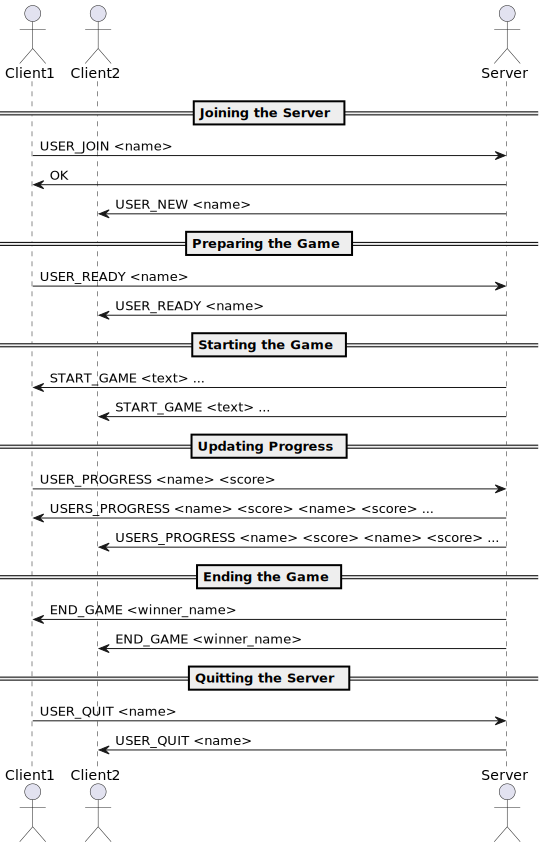

# Application Protocol

- [Commands](#commands)
  - [Join the Sever](#join-the-sever)
  - [Prepare the Game](#prepare-the-game)
  - [Start the Game](#start-the-game)
  - [Update the Progress](#update-the-progress)
  - [End the Game](#end-the-game)
  - [Quit the Sever](#quit-the-sever)
- [Sequence Diagram](#sequence-diagram)
  - [General Protocol](#general-protocol)
  - [Client Error when Joining the Server](#client-error-when-joining-the-server)

## Commands

- `score` is defined as number of letters completed

### Join the Sever

The client intitiates the request.

**Request:**

```
USER_JOIN <name>
```

**Response:**

```
OK
USER_PROFILE ERR <msg>
```

**Response to other all Clients:**

```
USER_NEW <name>
```

### Prepare the Game 

The client intitiates the request.

**Request:**

```
USER_READY <name>
```

**Response to all other clients:**

```
USER_READY <name>
```

### Start the Game 

The server intitiates the request.

**Request:**

```
START_GAME <text> ...
```

**Response:**

No response.

### Update the Progress

The client intitiates the request at every valid keypress from the client.


**Request:**

```
USER_PROGRESS <name> <score> 
```

**Response:**

```
USERS_PROGRESS <name> <score> <name> <score> <name> <score> <name> <score> ...
```

### End the Game 

The server intitiates the request.

**Request:**

```
END_GAME <winner_name>
```

**Response:**

No response.

### Quit the Sever

The client intitiates the request.

**Request:**

```
USER_QUIT <name>
```

**Response to all other clients:**

```
USER_QUIT <name>
```

## Sequence Diagram

### General Protocol



### Client Error when Joining the Server


```staruml
@startuml
actor Client1
actor Client2
actor Server

== Joining the Server ==

Client1 -> Server: USER_JOIN <name>
Server -> Client1: OK
Server -> Client2: USER_NEW <name>

== Preparing the Game ==

Client1 -> Server: USER_READY <name>
Server -> Client2: USER_READY <name>

== Starting the Game ==

Server -> Client1: START_GAME <text> ...
Server -> Client2: START_GAME <text> ...

== Updating Progress ==

Client1 -> Server: USER_PROGRESS <name> <score>
Server -> Client1: USERS_PROGRESS <name> <score> <name> <score> ...
Server -> Client2: USERS_PROGRESS <name> <score> <name> <score> ...

== Ending the Game ==

Server -> Client1: END_GAME <winner_name>
Server -> Client2: END_GAME <winner_name>

== Quitting the Server ==

Client1 -> Server: USER_QUIT <name>
Server -> Client2: USER_QUIT <name>
@enduml
```

```
@startuml
actor Client1
actor Server

== Joining the Server (Error) ==

Client1 -> Server: USER_JOIN <name>
Server -> Client1: USER_JOIN_ERR <msg>
@enduml
```