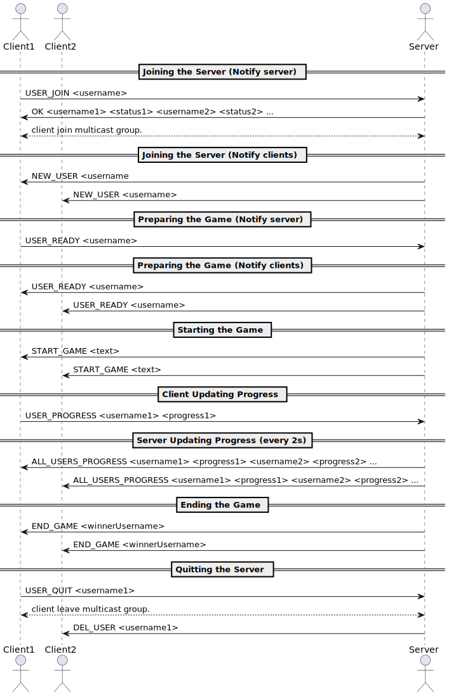
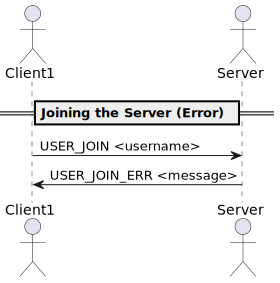
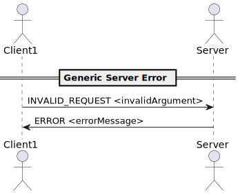

# Application Protocol

- [Overview](#overview)
- [Transport protocol](#transport-protocol)
  - [Join the server](#join-the-server)
  - [Prepare the game](#prepare-the-game)
  - [Start the game](#start-the-game)
  - [Update the progress](#update-the-progress)
  - [Quit the server](#quit-the-server)
  - [Error](#error)
- [Messages](#messages)
  - [Join the server](#join-the-server-1)
  - [Prepare the game](#prepare-the-game-1)
  - [Start the game](#start-the-game-1)
  - [Update the progress](#update-the-progress-1)
  - [End the game](#end-the-game)
  - [Quit the server](#quit-the-server-1)
  - [General error message](#general-error-message)
- [Examples](#examples)
  - [General protocol](#general-protocol)
  - [Error when joining the server](#error-when-joining-the-server)
  - [Generic error when providing illegal request](#generic-error-when-providing-illegal-request)
- [Annexes](#annexes)
  - [UML sources](#uml-sources)

## Overview

The "FastPaws" protocol is a communication protocol that allow multiple clients to compete in a typing race.

## Transport protocol

The "FastPaws" protocol is a text transport protocol. It uses UDP transport protocol as we do not require reliability.

Every message is encoded in UTF-8 and delimited by a space character. They are treated as text messages.

For every port and address mentioned below, we specify the default value but these can be changed using options of the command lines.

When starting the server, it listens for unicast UDP messages on http://localhost:4445

The server will send messages using multicast with UDP fire-and-forget pattern /230.0.0.0:4446 
(we always refer to this when talking about the server sending multicast request below), this communication doesn't need to be initiated.

### Join the server

The client initiate the communication using unicast with UDP request-response pattern on the server port : 4445.

This first request is asking to join the game with a given username. 

The server has to verify if that username is valid (isn't already taken, too long or contains invalid characters). 

If the username is valid, the server stores it and responds with a list of all the other usernames of clients waiting to play
and indicating their status (ready, not ready, in game).
It will also send a multicast request to inform that a new client joined providing his username.

If it is not valid, it responds by asking the client to choose another username until a valid one is proposed.

After succeeding in joining the game, the client closes the unicast communication and join a multicast group to listen for multicast UDP messages on /230.0.0.0:4446.

### Prepare the game

The client initiate a request to indicate that he is ready to compete using unicast UDP fire-and-forget pattern on the server port : 4445.

The server send a multicast request to inform that this client is now ready.

### Start the game

Once the required number of ready clients is reached (currently 2), 
the server send a multicast request to inform that the game is starting by sending the text to type.

### Update the progress

The clients initiate a request at every valid keypress to send their progress using unicast UDP fire-and-forget pattern on the server port : 4445.

If one client reached 100%, the server send a multicast request indicating that the game is over and informing of the username of the winner.

Every 2 seconds, The server send a multicast request with the usernames and progress of all clients.

### Quit the server 

At any time, a client can send a request to quit the game using unicast UDP fire-and-forget pattern on the server port : 4445.

The server send a multicast request to inform that a client left, indicating his username.

It also checks if all the clients left, and end the game if it is the case.

When the game end, every clients go back to the preparation of the game step where they are asked if they are ready, we can start a new game.

### Error

For every request sent by the client, if we have an unknown message/illegal number of arguments/unknown action/exception 
the server must send a unicast UDP response with an error message to the client indicating what the issue is. 
This of course uses the address and port of the client that initiated the communication.

We use string messages for communicating the error description.

## Messages

- `username` the username of the client
- `progress` is defined as the percentage (integer between 0 and 100) of completed letters.
- `...` denotes arbitrary length string and should be parsed until the end of line.

### Join the server

The client send a message to the server indicating his username.

**Request:**

```
USER_JOIN <username>
```

**Response:**

```
OK <username1> <status1> <username2> <status2> : the client joined successfully, the list of connected client and their status
USER_JOIN_ERR <message ...> : an error occured when trying to join, the message describe what happended (ex : username already taken.)
```
- `status` is defined as the player state the possible values being : NOT_READY, READY, IN_GAME

The client is responsible for displaying the information about the other clients.

If the client joined successfully, the server send a multicast request to inform a new client joined.

**Request:**

```
NEW_USER <username>
```

After successfully connecting, the client join the multicast group. 

### Prepare the game 

The client initiates a request to indicate he is ready.

**Request:**

```
USER_READY <username>
```

**Response:**

```
No response.
```

The server send a multicast request to inform that this client is ready.

**Request:**

```
USER_READY <username>
```

### Start the game 

The server send a multicast request to inform that the game starts and provide the text to type.

**Request:**

```
START_GAME <text>
```
The client is responsible for displaying the text and input of the player.

### Update the progress

The client initiates a request to send his progress at every keypress, it is responsible for calculating the progress.

**Request:**

```
USER_PROGRESS <username> <progress> 
```

**Response:**

```
No response.
```

Every 2 seconds, the server send a multicast request to inform of the progress of each client.
```
ALL_USERS_PROGRESS <username1> <progress1> <username2> <progress2>  ...
```
The client is responsible for displaying the progress of all other clients.

### End the game 

When a client reached 100%, the server send a multicast request to inform the game is over and indicate who the winner is.

**Request:**

```
END_GAME <winnerUsername>
```
- `winnerUsername` : username of the winning client

The client responsible for displaying the game over screen and the winner username.

### Quit the server

The client send a request to quit the server.

**Request:**

```
USER_QUIT <username>
```

**Response:**

```
No response.
```

The server send a multicast request to inform a client left.

**Request:**

```
DEL_USER <username>
```
The client is responsible updating the display of the current clients in game, by removing him.

### General error message

For all generic errors, the server can respond to a request with :

**Response:**

```
ERROR <errorMessage ...>
```
- `errorMessage` : specify what the issue is.

## Examples

### General protocol



### Error when joining the server



### Generic error when providing illegal request



## Annexes

### UML sources

```staruml
@startuml
actor Client1
actor Client2
actor Server

== Joining the Server (Notify server) ==

Client1 -> Server: USER_JOIN <username>
Server -> Client1: OK <username1> <status1> <username2> <status2> ...
Client1<-->Server: client join multicast group.
== Joining the Server (Notify clients) ==

Server -> Client1: NEW_USER <username
Server -> Client2: NEW_USER <username>

== Preparing the Game (Notify server) ==

Client1 -> Server: USER_READY <username>

== Preparing the Game (Notify clients) ==
Server -> Client1: USER_READY <username>
Server -> Client2: USER_READY <username>

== Starting the Game ==

Server -> Client1: START_GAME <text>
Server -> Client2: START_GAME <text>

== Client Updating Progress ==

Client1 -> Server: USER_PROGRESS <username1> <progress1>


== Server Updating Progress (every 2s)==

Server -> Client1: ALL_USERS_PROGRESS <username1> <progress1> <username2> <progress2> ...
Server -> Client2: ALL_USERS_PROGRESS <username1> <progress1> <username2> <progress2> ...

== Ending the Game ==

Server -> Client1: END_GAME <winnerUsername>
Server -> Client2: END_GAME <winnerUsername>

== Quitting the Server ==

Client1 -> Server: USER_QUIT <username1>
Client1<-->Server: client leave multicast group.
Server -> Client2: DEL_USER <username1>

@enduml
```

```staruml
@startuml
actor Client1
actor Server

== Joining the Server (Error) ==

Client1 -> Server: USER_JOIN <username>
Server -> Client1: USER_JOIN_ERR <message>

@enduml
```

```staruml
@startuml
actor Client1
actor Server

== Generic Server Error ==

Client1 -> Server: INVALID_REQUEST <invalidArgument>
Server -> Client1: ERROR <errorMessage>

@enduml
```